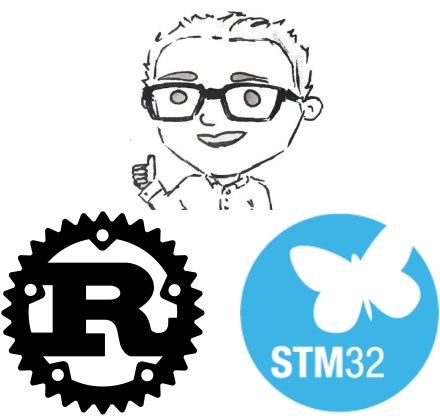

# Train Driver Firmware

[](https://github.com/ScottGibb/Train-Driver-Firmware/actions/workflows/.mega-linter.yaml) [](https://github.com/ScottGibb/Train-Driver-Firmware/actions/workflows/continuous-build.yaml)



## Summary

Bare-metal embedded Rust firmware for the Train Driver project. Reads two potentiometer inputs via ADC, maps them to percentage values, and drives PWM outputs to control motor power and LED brightness. A health indicator LED toggles at a configurable interval to confirm the system is running.

## Architecture

## Equipment

- [STM32F103C8T6 Blue Pill](https://stm32-base.org/boards/STM32F103C8T6-Blue-Pill.html)
- [ST-Link V2](https://stm32-base.org/boards/Debugger-STM32F101C8T6-STLINKV2)
- [Train Driver Hardware](https://github.com/ScottGibb/Train-Driver-Hardware)

## Dependencies

```bash
rustup target install thumbv7m-none-eabi
cargo install probe-rs-tools
```

## Build and Flash

```bash
cargo build --release
cargo run --release
```

### Examples

```bash
cargo run --example blinky_soft_timer    # Blink PC13 LED via SysTick
cargo run --example drive_leds           # Fade PA6/PA7 LEDs
cargo run --example read_pots            # Log raw ADC values from PA0/PA1
```

## Useful Links

- [stm32f1xx-hal documentation](https://docs.rs/stm32f1xx-hal)
- [embedded-hal traits](https://docs.rs/embedded-hal)
- [defmt logging framework](https://defmt.ferrous-systems.com)
- [probe-rs](https://probe.rs)
